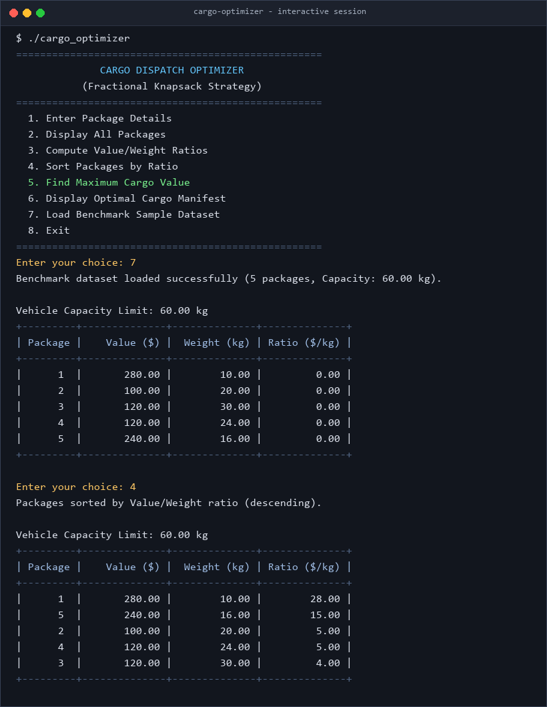
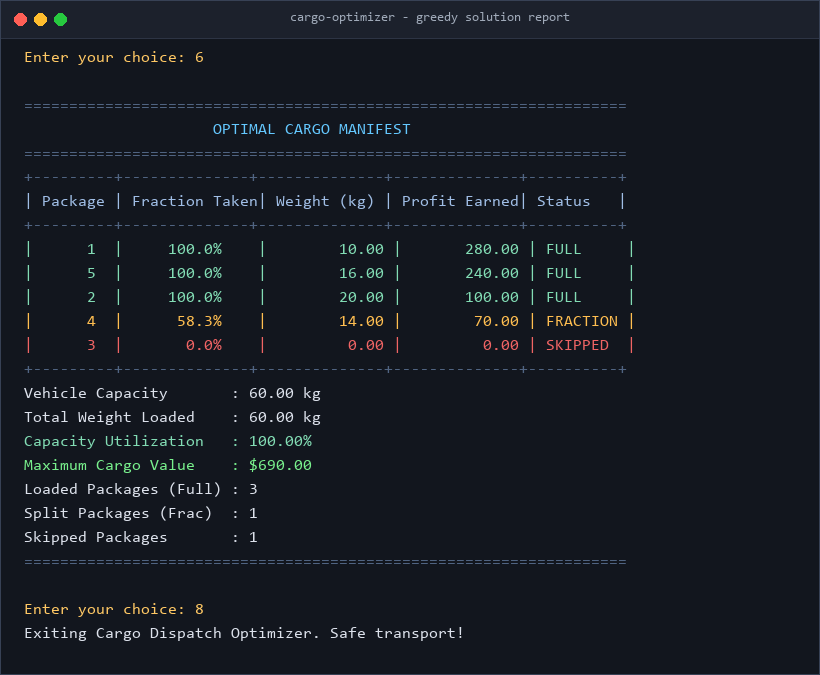

<div align="center">

# Cargo Optimizer

A straightforward C program applying the Fractional Knapsack greedy algorithm to solve vehicle cargo loading and payload profit maximization.

[](https://en.wikipedia.org/wiki/C_(programming_language))
[](LICENSE)
[](https://github.com/DevInfinix/cargo-optimizer/stargazers)
[](https://github.com/DevInfinix/cargo-optimizer/network/members)

[Why This Exists](#why-this-exists) • [Features](#features) • [How It Works](#how-it-works) • [Demo](#demo) • [Quick Start](#quick-start) • [Complexity Analysis](#complexity-analysis) • [Contributors](#contributors)

</div>

---

## Why This Exists

In our Algorithms course, we explored greedy algorithms and how picking the best immediate choice leads to a globally optimal outcome for certain classes of problems. The standard fractional knapsack is usually taught with plain weights and values, but in freight transport and dispatch logistics, vehicles have strict weight capacities, while cargo shipments yield different profit margins.

Unlike the 0/1 knapsack problem (which requires dynamic programming because items cannot be broken down), bulk shipments like grains, liquids, minerals, or divisible pallets can be loaded partially. I built this CLI tool in C to simulate vehicle dispatch loading, rank shipments by profit density, and verify that the greedy strategy achieves 100% capacity utilization while maximizing revenue.

---

## Features

- **Greedy Ratio Ranking**: Computes value-per-kilogram ratios (`profit / weight`) for every package to prioritize high-margin freight.
- **Fractional Loading**: Automatically splits the critical boundary package to fill every remaining kilogram of vehicle capacity.
- **Interactive Menu Interface**: Clean numbered CLI menu for entering data, inspecting tables, sorting, and generating manifests.
- **Benchmark Sample Dataset**: Includes a built-in 5-package logistics test dataset so you can run and test without manual typing.
- **Input Validation**: Rejects invalid package counts, zero/negative weights, and invalid capacities.
- **Detailed Manifest Table**: Clear ASCII report showing full packages, fractional percentages, weight loaded, profit earned, and capacity utilization.

---

## How It Works

The fractional knapsack strategy works in three main phases:

1. **Calculate Profit Density (Ratio)**: For each package $i$, determine its efficiency ratio:
   $$\text{Ratio}_i = \frac{\text{Value}_i}{\text{Weight}_i}$$
2. **Sort Descending**: Order all packages such that $\text{Ratio}_1 \ge \text{Ratio}_2 \ge \dots \ge \text{Ratio}_n$.
3. **Greedy Fill**: Iterate through the sorted list:
   - If the vehicle's remaining capacity $\ge \text{Weight}_i$, take the entire package ($x_i = 1.0$).
   - If the remaining capacity $< \text{Weight}_i$, take the exact fraction required to hit capacity ($x_i = \frac{\text{remaining}}{\text{Weight}_i}$), then stop.

```c
// Core greedy selection logic from main.c
for (i = 0; i < n; i++) {
    if (remaining >= p[i].weight) {
        p[i].quantity = 1.0f;
        remaining -= p[i].weight;
        totalWeight += p[i].weight;
        totalValue += p[i].value;
    } else if (remaining > 0) {
        p[i].quantity = remaining / p[i].weight;
        totalWeight += remaining;
        totalValue += (p[i].quantity * p[i].value);
        remaining = 0;
        break;
    }
}
```

---

## Demo

| Interactive Session & Sorting | Optimal Manifest & Utilization |
| :---: | :---: |
|  |  |

---

## Quick Start

### Prerequisites

You need a C compiler (`gcc`, `clang`, or MSVC) installed on your system.

### Build and Run

Clone the repository and compile using `gcc` or `make`:

```bash
# Clone repository
git clone https://github.com/DevInfinix/cargo-optimizer.git
cd cargo-optimizer

# Build using make
make

# Or compile manually with gcc
gcc -Wall -Wextra -std=c99 -O2 main.c -o cargo_optimizer

# Run the executable
./cargo_optimizer        # Linux / macOS
.\cargo_optimizer.exe    # Windows
```

---

## Benchmark Walkthrough

Using the built-in sample dataset (Menu Option 7):

- **Vehicle Capacity**: `60.00 kg`
- **Candidate Packages**:
  1. Package 1: Value `$280.00`, Weight `10.00 kg` $\rightarrow$ Ratio `$28.00/kg`
  2. Package 2: Value `$100.00`, Weight `20.00 kg` $\rightarrow$ Ratio `$5.00/kg`
  3. Package 3: Value `$120.00`, Weight `30.00 kg` $\rightarrow$ Ratio `$4.00/kg`
  4. Package 4: Value `$120.00`, Weight `24.00 kg` $\rightarrow$ Ratio `$5.00/kg`
  5. Package 5: Value `$240.00`, Weight `16.00 kg` $\rightarrow$ Ratio `$15.00/kg`

### Loading Outcome

| Package | Ratio ($/kg) | Taken (%) | Weight Loaded (kg) | Value Added ($) | Status |
| :--- | :---: | :---: | :---: | :---: | :--- |
| **Pkg 1** | $28.00 | 100.0% | 10.00 | $280.00 | Full |
| **Pkg 5** | $15.00 | 100.0% | 16.00 | $240.00 | Full |
| **Pkg 2** | $5.00 | 100.0% | 20.00 | $100.00 | Full |
| **Pkg 4** | $5.00 | 58.3% | 14.00 | $70.00 | Fraction |
| **Pkg 3** | $4.00 | 0.0% | 0.00 | $0.00 | Skipped |

- **Total Weight Loaded**: `60.00 kg`
- **Vehicle Utilization**: `100.00%`
- **Total Payload Value**: `$690.00`

---

## Complexity Analysis

| Operation | Time Complexity | Auxiliary Space | Explanation |
| :--- | :---: | :---: | :--- |
| Ratio Computation | $O(n)$ | $O(1)$ | Single pass over all package records |
| Ratio Sorting | $O(n^2)$ worst, $O(n)$ best | $O(1)$ | Bubble sort with early-exit flag (in-place) |
| Greedy Selection | $O(n)$ | $O(1)$ | Single linear pass filling remaining capacity |
| **Overall Program** | **$O(n^2)$** | **$O(1)$** | Dominated by sorting stage |

*Note: In larger industrial applications with thousands of packages, replacing bubble sort with QuickSort or MergeSort reduces sorting complexity to $O(n \log n)$.*

---

## Repository Structure

```text
cargo-optimizer/
├── docs/
│   └── screenshots/
│       ├── terminal-run.png       # Interactive CLI execution screenshot
│       └── cargo-results.png      # Optimal manifest report screenshot
├── .gitignore                     # Ignored binaries, temp files, and artifacts
├── LICENSE                        # MIT Open Source License
├── Makefile                       # Cross-platform compilation targets
├── README.md                      # Project documentation and analysis
└── main.c                         # Complete C implementation
```

---

## Contributors

<div align="center">

| Profile | Contributor | Role |
| :---: | :---: | :---: |
|  | [**DevInfinix**](https://github.com/DevInfinix) | Project Author & Algorithm Implementation |

</div>

---

## License

This project is licensed under the [MIT License](LICENSE).
